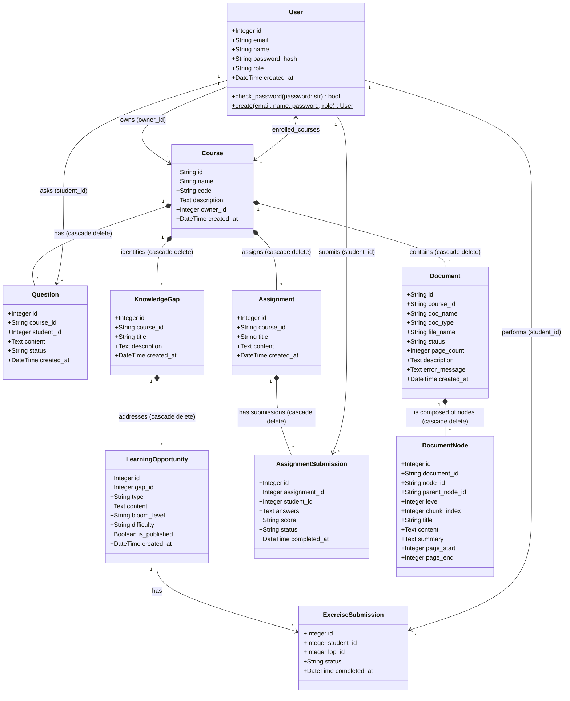

# Phân tích Cơ sở Dữ liệu KG2M (Class Diagram)

Tài liệu này cung cấp cấu trúc chi tiết của các bảng (classes) và mối quan hệ trong cơ sở dữ liệu `kg2m.db`, được trích xuất từ `models.py`. Bạn có thể sử dụng thông tin này để vẽ Class Diagram (Biểu đồ Lớp).

## 1. Biểu đồ Lớp (Mermaid Class Diagram)

Dưới đây là mã Mermaid để bạn có thể xem trực tiếp hoặc copy vào các công cụ hỗ trợ để hiển thị luồng thông tin (ví dụ: Obsidian, GitHub, Mermaid Live Editor).

## 2. Chi tiết các Bảng, Thuộc tính và Phương thức

Dưới đây là thông tin chi tiết từng bảng để bạn dễ dàng vẽ lên máy hoặc mô tả trong Class Diagram của tài liệu thiết kế.

### 2.1. Nhóm Người dùng (User Management)
**Class: User** (Ánh xạ bảng `users`)
*   `id`: Integer (Primary Key)
*   `email`: String(120), Unique, Not Null
*   `name`: String(100), Not Null
*   `password_hash`: String(100), Not Null
*   `role`: String(20) - Giá trị default: "student"
*   `created_at`: DateTime - Giá trị default: utcnow()
*   **Phương thức:** 
    * `check_password(password: str) -> bool`
    * `create(email, name, password, role) -> User` (Đây là Class Method - được ký hiệu `User$` trong UML)

**Bảng trung gian: `enrollments`** (Biểu diễn quan hệ Nhiều-Nhiều giữa User và Course, **không phải là class** trong bản thân models nhưng tạo ra liên kết Many-to-Many).
*   `user_id`: Integer, Foreign Key -> `users.id`
*   `course_id`: String(50), Foreign Key -> `courses.id`

### 2.2. Nhóm Học thuật & Khóa học (Academic & Course)
**Class: Course** (Ánh xạ bảng `courses`)
*   `id`: String(50) (Primary Key)
*   `name`: String(150), Not Null
*   `code`: String(20), Not Null
*   `description`: Text
*   `owner_id`: Integer, Foreign Key -> `users.id`, Not Null
*   `created_at`: DateTime - Giá trị default: utcnow()

**Class: Document** (Ánh xạ bảng `documents`)
*   `id`: String(50) (Primary Key)
*   `course_id`: String(50), Foreign Key -> `courses.id`, Not Null
*   `doc_name`: String(200), Not Null
*   `doc_type`: String(50) - Giá trị default: "lecture_notes"
*   `file_name`: String(300), Not Null
*   `status`: String(20) - Giá trị default: "processing"
*   `page_count`: Integer
*   `description`: Text
*   `error_message`: Text
*   `created_at`: DateTime - Giá trị default: utcnow()

**Class: DocumentNode** (Ánh xạ bảng `document_nodes`)
*   `id`: Integer (Primary Key)
*   `document_id`: String(50), Foreign Key -> `documents.id`, Not Null
*   `node_id`: String(100), Not Null
*   `parent_node_id`: String(100)
*   `level`: Integer - Giá trị default: 0
*   `chunk_index`: Integer, Not Null
*   `title`: String(500)
*   `content`: Text, Not Null
*   `summary`: Text
*   `page_start`: Integer
*   `page_end`: Integer

### 2.3. Nhóm Tương tác & Đánh giá (Assessment & Interaction)
**Class: Question** (Ánh xạ bảng `questions`)
*   `id`: Integer (Primary Key)
*   `course_id`: String(50), Foreign Key -> `courses.id`, Not Null
*   `student_id`: Integer, Foreign Key -> `users.id`, Not Null
*   `content`: Text, Not Null
*   `status`: String(20) - Giá trị default: "pending"
*   `created_at`: DateTime - Giá trị default: utcnow()

**Class: Assignment** (Ánh xạ bảng `assignments`)
*   `id`: Integer (Primary Key)
*   `course_id`: String(50), Foreign Key -> `courses.id`, Not Null
*   `title`: String(200), Not Null
*   `content`: Text (Chứa JSON array format), Not Null
*   `created_at`: DateTime - Giá trị default: utcnow()

**Class: AssignmentSubmission** (Ánh xạ bảng `assignment_submissions`)
*   `id`: Integer (Primary Key)
*   `assignment_id`: Integer, Foreign Key -> `assignments.id`, Not Null
*   `student_id`: Integer, Foreign Key -> `users.id`, Not Null
*   `answers`: Text (Chứa JSON string)
*   `score`: String(50)
*   `status`: String(20) - Giá trị default: "pending"
*   `completed_at`: DateTime

### 2.4. Nhóm Phát hiện Lỗ hổng kiến thức (Knowledge Gap Analytics)
**Class: KnowledgeGap** (Ánh xạ bảng `knowledge_gaps`)
*   `id`: Integer (Primary Key)
*   `course_id`: String(50), Foreign Key -> `courses.id`, Not Null
*   `title`: String(200), Not Null
*   `description`: Text
*   `created_at`: DateTime - Giá trị default: utcnow()

**Class: LearningOpportunity** (Ánh xạ bảng `learning_opportunities`)
*   `id`: Integer (Primary Key)
*   `gap_id`: Integer, Foreign Key -> `knowledge_gaps.id`, Not Null
*   `type`: String(50), Not Null (Có thể là "MCQ", "exercise", v.v.)
*   `content`: Text, Not Null (JSON hoặc text)
*   `bloom_level`: String(50)
*   `difficulty`: String(50)
*   `is_published`: Boolean - Giá trị default: False
*   `created_at`: DateTime - Giá trị default: utcnow()

**Class: ExerciseSubmission** (Ánh xạ bảng `exercise_submissions`)
*   `id`: Integer (Primary Key)
*   `student_id`: Integer, Foreign Key -> `users.id`, Not Null
*   `lop_id`: Integer, Foreign Key -> `learning_opportunities.id`, Not Null
*   `status`: String(20) - Giá trị default: "pending"
*   `completed_at`: DateTime

## 3. Bản chất các mối quan hệ (Multiplicity & Composition)

Mục này trình bày cơ sở để bạn gán số lượng (1..*) và kiểu quan hệ (Composition/Aggregation/Association) khi vẽ ở Draw.io, UMLet, Lucidchart...

*   **User -> Course (`owner`):** Một Giảng viên có thể sở hữu nhiều Khoá học. Một Khóa học phải thuộc về một Giảng viên. -> Quan hệ `Association` (1 - N).
*   **User <-> Course (`enrollments`):** Khóa học có nhiều Sinh viên và Sinh viên học nhiều khóa. -> Quan hệ `Association` (N - N).
*   **Course -> Question:** Một Course chứa nhiều câu hỏi (Questions). Khi khóa học xóa đi, tất cả câu hỏi bị xóa (cascade delete-orphan) -> Theo lý thuyết UML, đây là quan hệ `Composition` (Khóa học "chứa chứa" Câu hỏi).
*   **User -> Question (`student`):** Sinh viên đặt ra câu hỏi -> `Association` (1 - N).
*   **Course -> Document:** Khóa học chứa các Document, Document phụ thuộc Course (cascade delete) -> `Composition` (1 - N).
*   **Document -> DocumentNode:** Phân rã văn bản (chunks), Node phụ thuộc Document -> `Composition` (1 - N).
*   **Course -> KnowledgeGap:** Khóa học chứa thông tin lỗ hổng kiến thức -> `Composition` (1 - N).
*   **KnowledgeGap -> LearningOpportunity:** Từ một lỗ hổng mới có các bài học tương ứng bù đắp -> `Composition` (1 - N).
*   **LearningOpportunity -> ExerciseSubmission:** Bài học có các Submission của học sinh -> `Association` (1 - N).
*   **Course -> Assignment:** Khóa học có Bài kiểm tra/Bài tập (cascade delete) -> `Composition` (1 - N).
*   **Assignment -> AssignmentSubmission:** Sinh viên nộp bài cho Bài tập -> `Composition` (1 - N).
*   **User -> AssignmentSubmission & ExerciseSubmission:** Người dùng (Student) submit bài thi/bài tập -> `Association` (1 - N).
