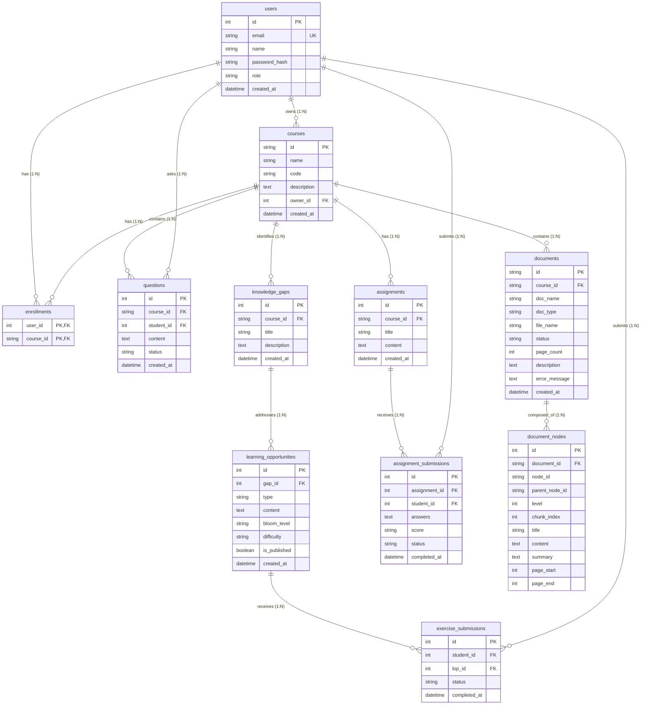

# Phân tích Cơ sở Dữ liệu KG2M (Entity Relationship Diagram)

Tài liệu này cung cấp cấu trúc chi tiết của các thực thể (Entities) và các mối quan hệ (Relationships) trong cơ sở dữ liệu `kg2m.db`, phục vụ cho việc vẽ **Entity Relationship Diagram (ERD)** mức vật lý.

## 1. Biểu đồ Thực thể - Liên kết (Mermaid ER Diagram)

Dưới đây là mã Mermaid sử dụng Cú pháp ER Diagram (Crow's foot notation). Bạn có thể sao chép mã này vào các công cụ như Obsidian, GitHub markdown, lưu bằng draw.io hoặc chạy trên [Mermaid Live Editor](https://mermaid.live/) để xem biểu đồ chi tiết với khoá chính (PK) và khóa ngoại (FK).

## 2. Thông tin chi tiết các Thực thể (Entities) và Kiểu dữ liệu

### 2.1. Quản lý Tài khoản (Identity Management)
**Thực thể: `users`** (Lưu thông tin tài khoản Giảng viên và Sinh viên)
- `id` (PK): Số nguyên (Integer) tự tăng.
- `email`: Chuỗi ký tự (String max 120), Unique.
- `name`: Chuỗi ký tự (String max 100).
- `password_hash`: Chuỗi ký tự (String max 100), để băm mật khẩu bảo mật.
- `role`: Chuỗi ký tự (String max 20), phân quyền "instructor" hoặc "student".
- `created_at`: Thời gian (DateTime).

### 2.2. Khóa học và Đăng ký (Course & Enrollment)
**Thực thể: `courses`**
- `id` (PK): Chuỗi mã định danh khóa học (String max 50).
- `name`: Tên khóa học (String max 150).
- `code`: Mã môn học (String max 20).
- `description`: Nội dung mô tả (Text).
- `owner_id` (FK): Khóa ngoại liên kết `users.id`, người tạo (instructor).
- `created_at`: Thời gian (DateTime).

**Thực thể Trung gian: `enrollments`** (Phân giải quan hệ nhiều nhiều giữa Users và Courses)
- `user_id` (PK, FK): Khóa ngoại tới `users.id`.
- `course_id` (PK, FK): Khóa ngoại tới `courses.id`.

### 2.3. RAG & Quản lý Tài liệu (Document Domain)
**Thực thể: `documents`**
- `id` (PK): Mã định danh (String max 50).
- `course_id` (FK): Khóa ngoại tới `courses.id`.
- `doc_name`: Tên tài liệu (String max 200).
- `doc_type`: Phân loại (String max 50).
- `file_name`: Tên file vật lý (String max 300).
- `status`: Trạng thái xử lý (String max 20).
- `page_count`: Số nguyên (Integer).
- `description`: Mô tả (Text).
- `error_message`: (Text).
- `created_at`: (DateTime).

**Thực thể: `document_nodes`** (Lưu chunk text của RAG)
- `id` (PK): Số nguyên tự tăng.
- `document_id` (FK): Khóa ngoại tới `documents.id`.
- `node_id`: Chuỗi định danh LlamaIndex (String max 100).
- `parent_node_id`: Chuỗi (String max 100).
- `level`, `chunk_index`, `page_start`, `page_end`: Số nguyên (Integer).
- `title`, `content`, `summary`: Văn bản.

### 2.4. Hỏi đáp & Bù đắp Kiến thức (Knowledge Flow)
**Thực thể: `questions`**
- `id` (PK): Danh tính câu hỏi (Integer).
- `course_id` (FK): Thuộc khóa học nào.
- `student_id` (FK): Khóa ngoại đến `users.id`.
- `content`: Nội dung câu hỏi (Text).
- `status`: Trạng thái xử lý (String).
- `created_at`: (DateTime).

**Thực thể: `knowledge_gaps`**
- `id` (PK): Số nguyên.
- `course_id` (FK): Khóa học chỉ định.
- `title`: Tên lỗ hổng (String max 200).
- `description`: Diễn giải lỗ hổng (Text).
- `created_at`: (DateTime).

**Thực thể: `learning_opportunities`**
- `id` (PK): Mã bài học/cách xử lý (Integer).
- `gap_id` (FK): Thuộc lỗ hổng nào `knowledge_gaps.id`.
- `type`: Loại hình (String max 50).
- `content`: Nội dung bài giải/câu hỏi ôn (Text).
- `bloom_level`: Cấp độ nhận thức (String max 50).
- `difficulty`: Mức độ khó (String max 50).
- `is_published`: Đã kích hoạt hay chưa (Boolean).
- `created_at`: (DateTime).

**Thực thể: `exercise_submissions`**
- `id` (PK): Số nguyên.
- `student_id` (FK): Ai làm (`users.id`).
- `lop_id` (FK): Làm bài tập bổ trợ nào (`learning_opportunities.id`).
- `status`: Trạng thái như "completed" (String).
- `completed_at`: (DateTime).

### 2.5. Bài Kiểm tra / Bài tập (Assignments Component)
**Thực thể: `assignments`**
- `id` (PK): Số nguyên.
- `course_id` (FK): Khoá học (`courses.id`).
- `title`: Tên bài tập.
- `content`: Lưu JSON mô tả các câu hỏi.
- `created_at`: (DateTime).

**Thực thể: `assignment_submissions`**
- `id` (PK): Số nguyên.
- `assignment_id` (FK): Khóa ngoại tới `assignments.id`.
- `student_id` (FK): Khóa ngoại tới `users.id`.
- `answers`: JSON câu trả lời.
- `score`: Điểm, ví dụ "8/10".
- `status`: Trạng thái hoàn thành.
- `completed_at`: (DateTime).

## 3. Kiến trúc Mối Quan Hệ (Relationships & Cardinality)

Thông qua cú pháp Crow's Foot trong ERD, ta có các chuỗi liên kết sau đây cần thể hiện khi cấu hình Data Model Constraint:

- **Quan hệ Tự gán Khóa học (Giảng viên tạo):** 1-Nhiều từ **`users`** đến **`courses`** dựa vào khóa `owner_id`.
- **Quan hệ Đăng ký học:** Nhiều-Nhiều giữa **`users`** và **`courses`**. Trong cơ sở dữ liệu vật lý (như ERD), mối quan hệ này được tách làm hai quan hệ 1-N qua bảng trung gian **`enrollments`**.
- **Bùng phát dữ liệu dọc theo Document:** Từ một khóa học **`courses`**, có thể có 0 hoặc N file **`documents`**. Tương ứng, với mỗi file văn bản, khi hệ thống RAG xử lý, nó sẽ băm thành 1 hay N chóp **`document_nodes`**. (Dữ liệu con hoàn toàn phụ thuộc vào Parent).
- **Hệ sinh thái Assignment:** 1 Khoá T học (**`courses`**) sinh ra nhiều **`assignments`**. Trong mỗi Assignment đó lại nhận về nhiều lượt submit (**`assignment_submissions`**) qua khóa `assignment_id`. Một user (sinh viên) có thể có nhiều submission.
- **Hệ sinh thái Hỗ trợ Kiến thức (Cốt lõi KG2M):** 
    - Sinh viên đặt câu hỏi nằm trong phạm vi khóa học => `users` liên kết `questions` (1-N) và `courses` liên kết `questions` (1-N).
    - Hệ thống đúc kết ra lộ hổng => Tương ứng liên kết `courses` tạo thành nhiều **`knowledge_gaps`** (1-N).
    - Để giải quyết lỗ hổng, sinh ra **`learning_opportunities`** => Một Knowledge Gap liên kết với N Learning Opportunities (1-N).
    - Sự phản hồi từ sinh viên qua bài bổ trợ => **`exercise_submissions`** ánh xạ người tham gia (`student_id` từ `users`) cùng nhiệm vụ cụ thể (`lop_id` từ `learning_opportunities`).
