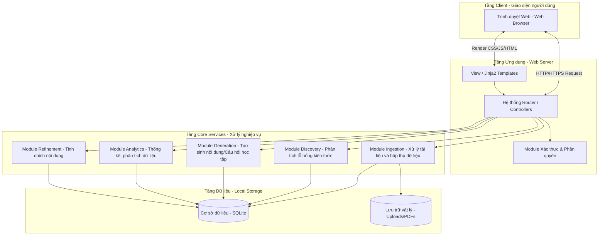

# 4.3.3 Thiết kế kiến trúc hệ thống

## Hệ thống liên kết với các services khác như thế nào
Vì hệ thống này được thiết kế theo cấu trúc khép kín (closed-loop) nhằm đảm bảo tính bảo mật và sự tự chủ về mặt dữ liệu cá nhân cũng như tài liệu học thuật theo yêu cầu thiết kế dự án, hệ thống hướng tới việc xử lý toàn bộ các tác vụ xử lý thông minh bên trong nội bộ máy chủ mà **không phụ thuộc vào các API hay dịch vụ gọi từ bên ngoài**. 

**Ví dụ:**
- Thay vì gọi API từ các nhà cung cấp bên ngoài để phân tích ngôn ngữ tự nhiên và tạo sinh nội dung, hệ thống sử dụng các module AI/LLM triển khai cục bộ (Local Model/Core Logic) phục vụ cho dịch vụ **Ingestion** (xử lý tài liệu bài giảng PDF) và **Generation** (tạo sinh câu trả lời, thiết kế bài kiểm tra).
- Mọi tương tác hệ thống như quản lý phiên làm việc, phân tích dữ liệu học tập (Analytics), và cơ sở dữ liệu lưu trữ (SQLite) đều nằm chung trong cùng một máy chủ backend. Hệ thống đóng vai trò như một Web Server khép kín và giao tiếp với trình duyệt cá nhân của người dùng bằng giao thức HTTP/HTTPS.

## Kiến trúc hệ thống
Hệ thống KG2M sử dụng kiến trúc dựa trên mô hình MVC kết hợp với tổ chức Service-Oriented nội bộ. Dưới đây là sơ đồ kiến trúc tổng quan:

## Chức năng nào nằm ở phần nào trong sơ đồ kiến trúc

Dựa vào sơ đồ trên, kiến trúc phân bổ các chức năng thành các tầng cụ thể như sau:

**1. Tầng Client (Giao diện người dùng - Trình duyệt Web)**
- **Web Browser (UI)**: Nơi tương tác trực tiếp với Người học (Student) và Giảng viên (Instructor). Hiển thị các giao diện bảng điều khiển (Dashboard), giao diện tải tài liệu (`courses/create`), giao diện người học đặt câu hỏi (`courses/ask`) và bảng biểu thống kê kết quả.

**2. Tầng Ứng dụng (Trình xử lý yêu cầu - Web Server)**
- **Hệ thống Router**: Vai trò của các Tệp Routes (ví dụ: `auth.py`, `courses.py`, `analytics.py`), nhận yêu cầu gửi lên từ Client và điều hướng chúng đến đúng các module xử lý logic.
- **Xác thực & Phân quyền (Auth)**: Chịu trách nhiệm quản lý phiên bản (sessions), đăng nhập, đăng xuất, và chặn quyền không hợp lệ giữa Giảng viên và Học viên.
- **View / Jinja2 Templates**: Trình kết xuất giao diện HTML động. Nhận kết quả từ Router xử lý và trả về dạng trang Web hoàn chỉnh hiển thị lên trình duyệt.

**3. Tầng Core Services (Logic cốt lõi - Xử lý nghiệp vụ)**
- **Module Ingestion**: Chịu trách nhiệm tiếp nhận file upload lên hệ thống, bóc tách cấu trúc văn bản, đọc text từ PDF và chuẩn hóa dữ liệu. Tuân thủ thiết kế hoàn toàn xử lý bằng thư viện nội bộ.
- **Module Discovery**: Chịu trách nhiệm đối chiếu câu hỏi của người học với sơ đồ tài liệu từ Ingestion để phân tích và chỉ ra các "Lỗ hổng kiến thức" (Knowledge Gaps).
- **Module Generation**: Chịu trách nhiệm thiết lập câu trả lời hỗ trợ học viên giải đáp thắc mắc, tự động tạo các bài trắc nghiệm (Quizzes) liên quan đến Lỗ hổng kiến thức dựa trên mô hình thông minh nội bộ.
- **Module Analytics**: Xử lý logic truy vấn số liệu nhằm thống kê báo cáo hiệu suất học tập, mức độ tiếp thu và các vấn đề cần lưu ý cho Giảng viên trên Dashboard.
- **Module Refinement**: Chức năng hỗ trợ giảng viên (Instructor) xem xét, đánh giá và tinh chỉnh thủ công các dữ liệu trước khi cung cấp hiển thị chính thức cho học viên.

**4. Tầng Dữ liệu (Lưu trữ và Cơ sở dữ liệu)**
- **Lưu trữ vật lý (FileStore)**: Nơi hệ thống ghi nhận, lưu giữ các tệp tin bài giảng PDF/Docs gốc do giảng viên đã tải lên (local filesystem).
- **Cơ sở dữ liệu (SQLite)**: Cơ sở dữ liệu quan hệ, lưu trữ toàn bộ dữ liệu nghiệp vụ theo cấu trúc bao gồm các bảng: *Users, Courses, Questions, KnowledgeGaps, Quizzes*, đảm bảo truy xuất nhanh và bảo mật ngay trong không gian nội bộ hệ thống.
