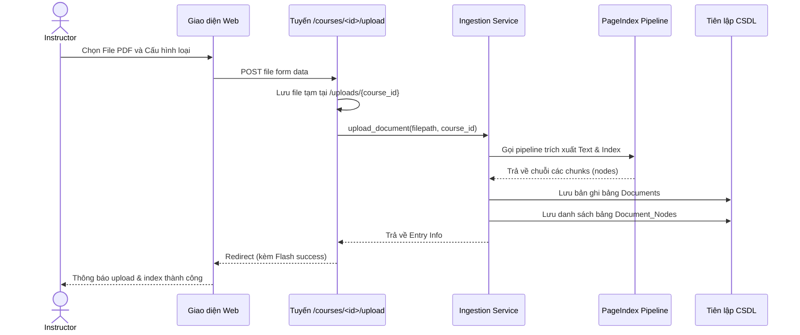
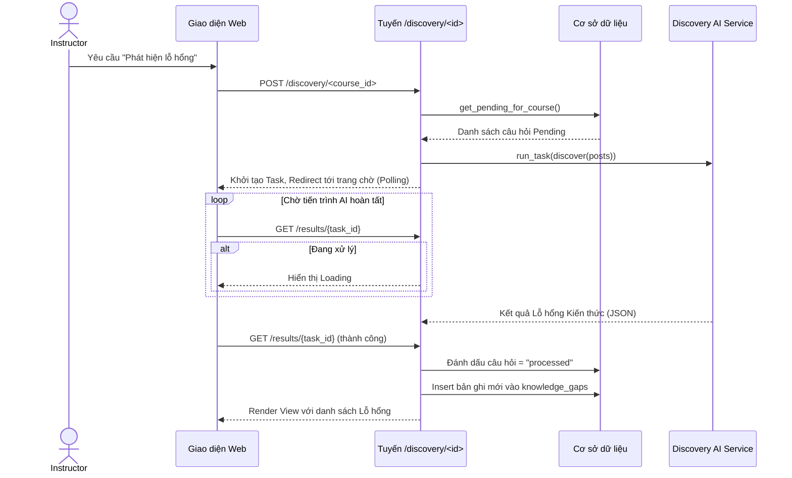
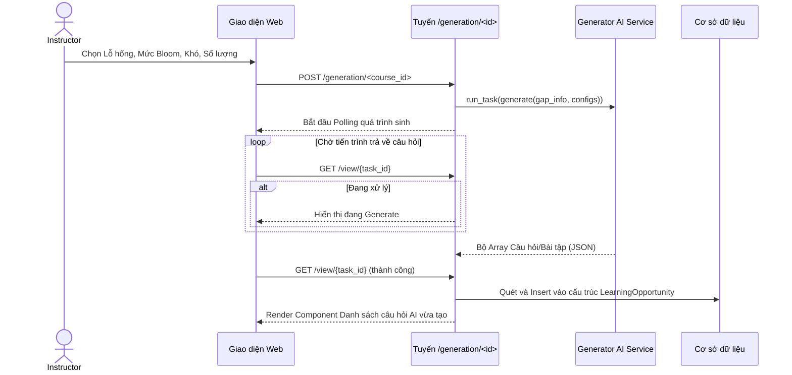
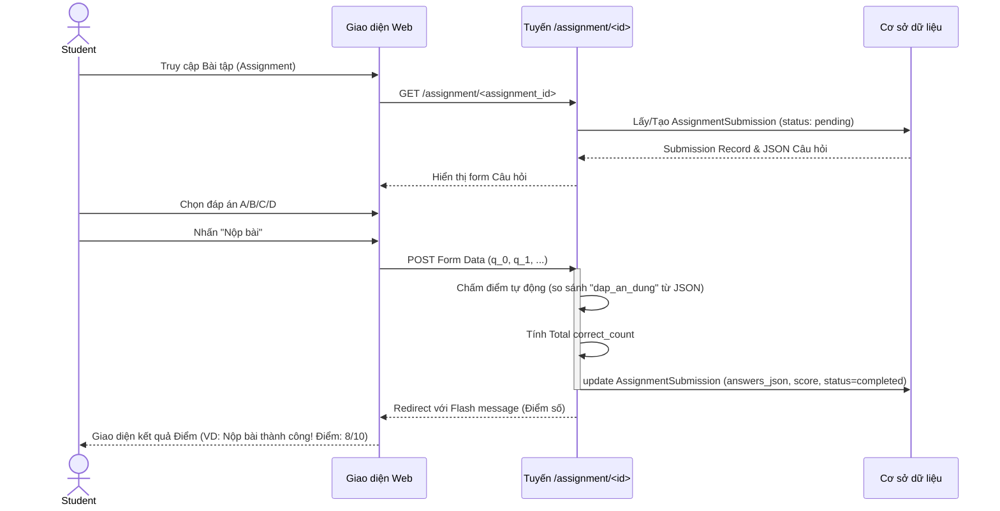
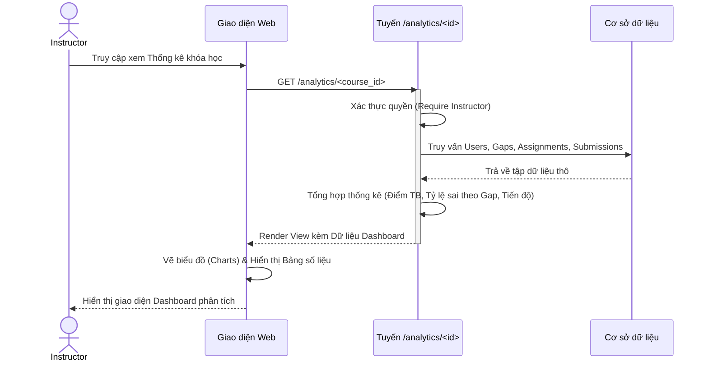

# Phân tích Luồng Hoạt Động Hệ Thống KG2M (Sequence Diagrams)

Dựa trên việc đọc và phân tích mã nguồn Controller (`routes/courses.py`, `routes/discovery.py`, `routes/generation.py`) cùng với luồng thao tác của các Services, dưới đây là chi tiết phân tích và kịch bản Sequence Diagram cho 4 luồng (Flows) chính mà bạn yêu cầu.

## 4.2.5.1 Luồng nạp và xử lý tài liệu (Document Ingestion)

Mục đích: Giảng viên đưa học liệu dạng PDF lên hệ thống để RAG (PageIndex) phân tách thành các Node dữ liệu chuẩn bị cho quá trình tạo sinh và trả lời ngữ cảnh.

**Các bước chính:**
1. **Giảng viên** tải file tài liệu (PDF) từ giao diện máy khách.
2. **Hệ thống (Router)** tiếp nhận file vật lý dể lưu vào thư mục `uploads/course_id/`.
3. Gọi **IngestionService** thực thi hàm `upload_document`.
4. Dịch vụ đưa file cho **PageIndex (RAG Pipeline)** để trích xuất text và băm nhỏ thành các document chunks (nodes).
5. Sau khi xử lý xong, thông tin được lưu xuống DB ở 2 bảng `documents` và `document_nodes`.
6. Trả trạng thái kèm thông điệp (Flash) thông báo thành công ở phía Giao diện (View).

## 4.2.5.2 Luồng phát hiện lỗ hổng (Knowledge Gap Discovery)

Mục đích: Hệ thống tự động gom nhóm các câu hỏi chưa xử lý (pending) của sinh viên trong khóa học để gửi cho AI Language Model, từ đó khái quát lên "Lỗ hổng kiến thức".

**Các bước chính:**
1. **Giảng viên** vào trang Quản trị lỗ hổng và nhấn nút Phát hiện mới.
2. **Router** truy vấn `QuestionRepo` lấy danh sách câu hỏi đang `pending`.
3. Router khởi tạo tiến trình nền (Background Task) thông qua qua cơ chế `run_task`, chuyển nội dung sang cho **Discovery AI Service**.
4. Controller trả về ngay giao diện chờ (Polling loading) để không bị nghẽn (timeout) khi AI chạy. Giao diện thỉnh thoảng gọi lại API trạng thái `results/[task_id]`.
5. Sau khi AI trả về kết quả (JSON định dạng các lỗ hổng), **Router** duyệt lưu trữ nhóm lỗ hổng vảo bảng `knowledge_gaps`. Đồng thời đánh dấu `status = 'processed'` cho các câu hỏi tương ứng.

## 4.2.5.3 Luồng tạo sinh cơ hội học tập (Learning Opportunity Generation)

Mục đích: Từ một "Lỗ hổng", giảng viên thiết lập cấu hình mức độ khó (Bloom level), số lượng, dạng bài (Trắc nghiệm MCQ). Hệ thống gọi AI để tạo ra các bài tập tự động được nạp bằng Document RAG Context.

**Các bước chính:**
1. **Giảng viên** chọn Lỗ hổng mục tiêu, yêu cầu Mức độ Bloom (Ví dụ: Vận dụng / Application) và bấm "Tạo sinh".
2. Hệ thống gọi background task cho `generator.generate(...)`.
3. AI kết hợp ngữ cảnh là các logs sinh viên thắc mắc và tài liệu (Course Context) để thiết kế câu hỏi dạng MCQs.
4. Giao diện Polling gọi API trả về kết quả cấu trúc bài.
5. Khi Task thành công, **Router** lưu trữ chuỗi JSON của các câu hỏi vào model tạo thành các `LearningOpportunity` (gắn liền vào `KnowledgeGap` cha).

## 4.2.5.4 Luồng sinh viên làm bài tập (Student Assignment / Exercise flow)

Mục đích: Sinh viên truy cập vào bài kiểm tra (Assignment) đã được gộp từ các Cơ hội học tập, sau đó làm trực tiếp trên giao diện trình duyệt. Nhấn nộp và được chấm điểm tự động.

**Các bước chính:**
1. **Sinh viên** mở giao diện chi tiết Bài Khảo Sát / Assignment.
2. Web gọi Router GET dữ liệu -> Router tìm thấy trạng thái `pending` của `AssignmentSubmission` (hoặc tạo mới nếu chưa tồn tại).
3. Đổ HTML hiển thị các câu hỏi trắc nghiệm ra giao diện.
4. Chọn đáp án trên form, bấm Gửi (POST).
5. **Router** đánh giá (Grading) bằng logic: lấy Form Input (`student_choice`) kiểm tra khớp với `dap_an_dung` được parse từ trường JSON lưu tại bảng Submission / Assignment.
6. Tính được tổng điểm `score_str` => Ghi đè vào submission. Cập nhật `status = 'completed'`.

## 4.2.5.5 Luồng giảng viên xem thống kê (Instructor Analytics / Dashboard)

Mục đích: Giảng viên theo dõi, phân tích tình hình học tập của sinh viên thông qua các bài kiểm tra, tiến độ hoàn thành, và hiệu suất đối với từng "Lỗ hổng kiến thức".

**Các bước chính:**
1. **Giảng viên** truy cập vào giao diện Dashboard Thống kê của khóa học (`/analytics/<course_id>`).
2. **Router (`analytics_bp`)** tiếp nhận yêu cầu và xác thực quyền `instructor`.
3. **Router** truy vấn Cơ sở dữ liệu (DB) để lấy tổng hợp dữ liệu từ các danh mục: Sinh viên enrolled, Câu hỏi, KnowledgeGaps, Assignments, và AssignmentSubmissions (những bài đã `completed`).
4. **Router** thực hiện phân tích số liệu: 
   - Điểm số trung bình (Overall avg score).
   - Tỷ lệ hoàn thành (Completion %).
   - Tỷ lệ trả lời sai theo từng Lỗ hổng (Knowledge Gap wrong rates).
   - Tiến độ thực hiện bài tập của từng sinh viên (Student progress).
5. Dữ liệu sau khi tổng hợp được truyền về cho **Giao diện Web**.
6. **Giao diện Web** (`dashboard.html`) render các biểu đồ (charts) phân bố điểm, tỷ lệ sai theo lỗ hổng và các bảng biểu báo cáo chi tiết.

